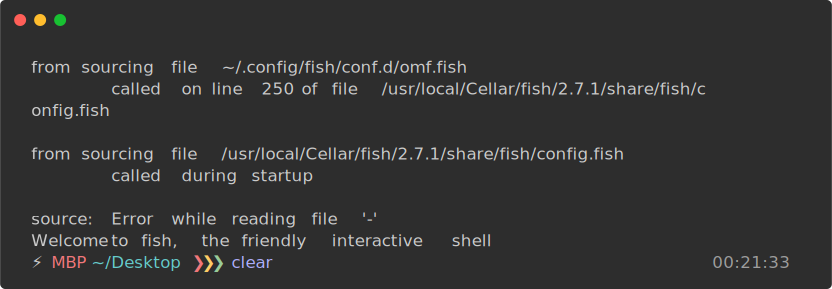

================
Getting Started
================

Install
^^^^^^^^^

You can install the program with the following command:  

.. code:: bash

  $ pip install yt2mp3

Prerequisites  
-------------

The program only requires that you have Python 3.4+ and `ffmpeg <https://www.ffmpeg.org/>`_ or `libav <https://www.libav.org/>`_ installed. More installation information is available on the `additional setup <http://yt2mp3.rtfd.io>`_ page.

----------------------

Usage  
^^^^^^^

Once installed, the program can be executed via the command-line as follows:

.. code:: bash
  
  $ yt2mp3 [-options]

When the program is finished, you can find the resulting MP3 file in your *Downloads* directory, with the following file-structure ``Music/{artist}/{track}.mp3``.

Options
--------

.. list-table::
  :widths: 25 75
  :header-rows: 0

  * - ``-t, --track``
    - Specify the track name query
  * - ``-a, --artist``
    - Specify the artist name query
  * - ``-c, --collection``
    - Specify the album name query
  * - ``-u, --url``
    - Specify a Youtube URL or ID 
  * - ``-u, --url``
    - Specify a Youtube URL or ID
  * - ``-p, --playlist``
    - Specify a Youtube playlist URL or ID 
  * - ``-o, --overwrite``
    - Overwrite the file if one exists in output directory
  * - ``-r, --resolution``
    - Specify the resolution for the cover-art
  * - ``-q, --quiet``
    - Suppress program command-line output 
  * - ``-v, --verbose``
    - Display a command-line progress bar
  * - ``--version``
    - Show the version number and exit
  * - ``-h, --help``
    - Display information on usage and functionality

-----------------

Contributing
^^^^^^^^^^^^^

If you'd like to contribute to the project, you can download and install the program with the following commands:  

.. code:: bash

  # Clone the repository
  $ git clone https://github.com/tterb/yt2mp3

  # Navigate to the directory
  $ cd yt2mp3

  # Install program dependencies
  $ pip install -r requirements.txt
  
|
